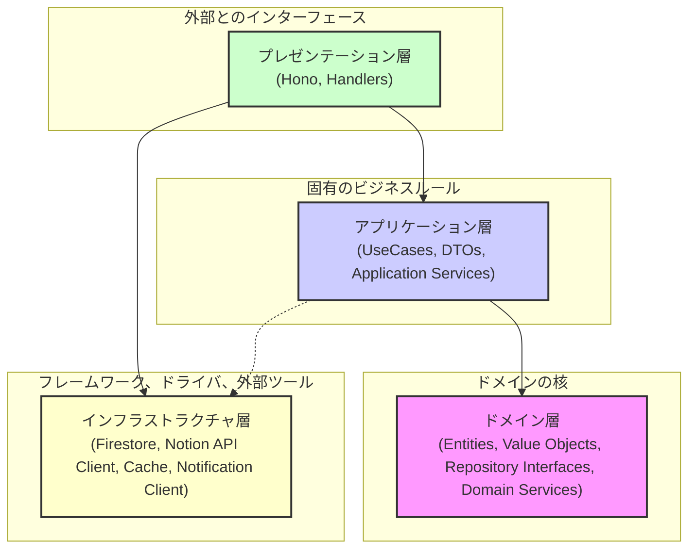

# アプリケーションアーキテクチャ

Notifier アプリは、変更容易性、テスト容易性、関心の分離を重視し、クリーンアーキテクチャの原則に基づいて設計されています。
このアーキテクチャにより、各コンポーネントは独立して開発・テストが可能となり、将来的な機能追加や技術変更にも柔軟に対応できます。

## レイヤー構造

アプリケーションは、大きく分けて以下の 4 つのレイヤーで構成されています。依存関係は常に外側のレイヤーから内側のレイヤーへ向かい、内側のレイヤーは外側のレイヤーについて関知しません。

-   **ドメイン層 (Domain Layer)**:

    -   アプリケーションの核となるビジネスロジックとエンティティを定義します。
    -   **エンティティ (`Template`, `Destination`)**: アプリケーションの主要なビジネスオブジェクト。自身のデータとそれに関連するバリデーションルールを持ちます。
    -   **値オブジェクト**: 特定の意味を持つ不変のデータ（例: Webhook URL、テンプレート本文など）。
    -   **リポジトリインターフェース (`TemplateRepository`, `DestinationRepository`)**: エンティティの永続化操作の契約（インターフェース）を定義します。具体的な実装はインフラストラクチャ層に委ねます。
    -   **ドメインサービス (`NotionApiService`, `CacheService`, `MessageFormatterService`, `NotificationClient`, `templateMatcherService`)**: 特定のエンティティに属さない、ドメイン固有のロジックや外部サービスとの契約を定義・実装します。

-   **アプリケーション層 (Application Layer)**:

    -   アプリケーション固有のビジネスルール（ユースケース）を実装します。
    -   **ユースケース (`CreateTemplateUseCase`, `ProcessNotionWebhookUseCase`など)**: ユーザーや他のシステムがアプリケーションに対して実行したい具体的な操作を定義します。ドメイン層のエンティティやリポジトリインターフェースを利用して処理を実行します。
    -   **DTO (Data Transfer Objects)**: ユースケースの入力 (`XxxInput`) および出力 (`XxxOutput`) のためのデータ構造を定義します。
    -   **アプリケーションサービス (`MessageFormatterServiceImpl`など)**: ユースケースを補助する、ドメイン知識を含まないアプリケーション固有のサービス。

-   **インフラストラクチャ層 (Infrastructure Layer)**:

    -   フレームワーク、ライブラリ、外部サービスへの具体的な実装詳細を扱います。
    -   **永続化実装 (`FirestoreTemplateRepository`, `InMemoryCacheService`など)**: ドメイン層で定義されたリポジトリインターフェースやサービスインターフェースの具体的な実装を提供します。Google Firestore、インメモリキャッシュなどが該当します。
    -   **Web クライアント (`NotionApiClient`, `HttpNotificationClient`など)**: Notion API や外部チャットツールの Webhook など、外部 API との通信を行う具体的な実装を提供します。
    -   **設定 (`docker-compose.yml`, `.env`など)**: 環境変数や外部サービスへの接続情報などを管理します。

-   **プレゼンテーション層 (Presentation Layer)**:
    -   ユーザーや外部システムとのインターフェースを担当します。
    -   **Hono フレームワーク関連**: ルーティング定義 (`src/main.ts`)、リクエストハンドラ (`src/presentation/handlers/`)、ミドルウェア、リクエストバリデーションなど。
    -   リクエストを受け取り、適切なアプリケーション層のユースケースに処理を委譲し、ユースケースからの結果を HTTP レスポンスとして返します。

## 主要なデータの流れ (Webhook 処理の例)

1.  **Webhook 受信**: Notion からの Webhook リクエストが Hono の特定エンドポイント (`/webhooks/notion`) に到着します (プレゼンテーション層)。
2.  **ユースケース実行**: リクエストは`NotionWebhookHandler`によって処理され、`ProcessNotionWebhookUseCase`に渡されます (プレゼンテーション層 → アプリケーション層)。
3.  **情報抽出・スキーマ取得**: `ProcessNotionWebhookUseCase`は受信データから`databaseId`等を抽出し、`NotionApiService` (実装: `NotionApiClient`) を介して Notion API からデータベーススキーマを取得します。この際、`CacheService`が利用されます (アプリケーション層 → ドメインサービス → インフラストラクチャ層)。
4.  **テンプレート取得**: `TemplateRepository` (実装: `FirestoreTemplateRepository`) を使用して、該当`databaseId`のテンプレートを取得します (アプリケーション層 → ドメインリポジトリ → インフラストラクチャ層)。
5.  **条件照合**: `templateMatcherService`が、受信したページプロパティ、取得したテンプレート、データベーススキーマを元に、条件に一致するテンプレートを特定します (アプリケーション層 → ドメインサービス)。
6.  **メッセージ整形**: `MessageFormatterService`が、一致したテンプレートとページプロパティを元に、通知メッセージを整形します (アプリケーション層 → ドメインサービス)。
7.  **送信先取得・通知送信**: 整形されたメッセージごとに、`DestinationRepository` (実装: `FirestoreDestinationRepository`) から送信先 Webhook URL を取得し、`NotificationClient` (実装: `HttpNotificationClient`) を使って外部チャットツールへ通知を送信します (アプリケーション層 → ドメインリポジトリ/サービス → インフラストラクチャ層)。

このアーキテクチャにより、各コンポーネントの責務が明確になり、柔軟で保守性の高いアプリケーションを目指しています。
