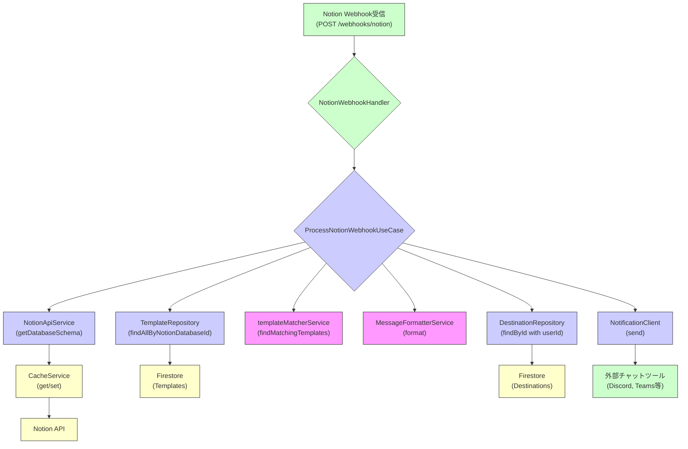

# Webhook 処理フロー解説

このドキュメントでは、Notion からの Webhook リクエストを受信してから、条件に一致するテンプレートに基づいて整形されたメッセージが外部チャットツールに通知されるまでの、Notifier アプリ内部の主要な処理フローを説明します。

このフローは主に `ProcessNotionWebhookUseCase` によって統括され、ドメイン層の各サービスやリポジトリと連携して実行されます。

## 処理フロー図 (概要)

_(この図は Mermaid 形式のコードです。対応するビューアで表示すると図としてレンダリングされます)_

## 詳細ステップ

1.  **Webhook 受信 (プレゼンテーション層)**:
    -   Notion のデータベース自動化機能から、設定されたトリガー（例: ページのプロパティ更新）に基づいて、Notifier アプリの `/webhooks/notion` エンドポイントに HTTP POST リクエストが送信されます。
    -   `NotionWebhookHandler` (in `src/presentation/handlers/notionWebhookHandler.ts`) がこのリクエストを受け取ります。
    -   （将来的には、このハンドラでリクエストの認証・署名検証を行います。）

2.  **ユースケース実行依頼 (プレゼンテーション層 → アプリケーション層)**:
    -   `NotionWebhookHandler` は、リクエストボディ（Notion からの Webhook ペイロード）を抽出し、`ProcessNotionWebhookUseCase` の `execute` メソッドに渡して処理を依頼します。

3.  **入力データ解析 (`ProcessNotionWebhookUseCase`)**:
    -   ユースケースは、受信した Webhook ペイロードから以下の主要な情報を抽出します。
        -   `databaseId`: 変更が発生した Notion データベースの ID。主にペイロードの `data.parent.database_id` から取得します。
        -   `pageProperties`: 変更されたページのプロパティ情報。ペイロードの `data.properties` から取得します。
        -   `pageUrl`: 変更されたページの URL。ペイロードの `data.url` から取得します。
    -   これらの情報が不足している場合は、エラーログを出力し処理を中断します。

4.  **データベーススキーマ取得 (`NotionApiService` & `CacheService`)**:
    -   ユースケースは、抽出した `databaseId` を使って `NotionApiService` (実装: `NotionApiClient`) の `getDatabaseSchema` メソッドを呼び出します。
    -   `NotionApiService` は、まず `CacheService` (実装: `InMemoryCacheService`) に該当のデータベーススキーマ情報がキャッシュされているか問い合わせます。
        -   **キャッシュヒットの場合**: キャッシュからスキーマ情報を取得し、Notion API への問い合わせは行いません。
        -   **キャッシュミスの場合**: `NotionApiClient` が `@notionhq/client` SDK を使用して Notion API (`databases.retrieve`) を呼び出し、データベーススキーマ情報を取得します。取得したスキーマ情報は、指定された TTL（Time To Live）で `CacheService` に保存された後、ユースケースに返されます。
    -   スキーマ情報が取得できなかった場合（API エラー、Not Found など）、エラーログを出力し処理を中断します。

5.  **該当テンプレートの取得 (`TemplateRepository`)**:
    -   ユースケースは、取得した `databaseId` を使って `TemplateRepository` (実装: `FirestoreTemplateRepository`) の **`findAllByNotionDatabaseId`** メソッドを呼び出し、このデータベースに関連付けられた全ての通知テンプレート（ユーザーを問わず）を取得します。
    -   該当するテンプレートが存在しない場合は、ログを出力し処理を中断します。

6.  **条件照合 (`templateMatcherService`)**:
    -   ユースケースは、取得したテンプレートの配列、受信した `pageProperties`、そしてデータベーススキーマ (`databaseSchema`) を `templateMatcherService` の `findMatchingTemplates` 関数に渡します。
    -   `findMatchingTemplates` 関数は、各テンプレートに設定された `conditions` 配列を評価します。
        -   各条件 (`propertyId`, `operator`, `value`) について、`databaseSchema` を参照してプロパティの型や選択肢情報を確認し、`pageProperties` の実際の値と比較します (`checkCondition` ヘルパー関数)。
        -   対応演算子: `=`, `!=`, `in`, `<`, `>`, `is_empty`, `is_not_empty`。
        -   テンプレートの全ての条件（AND 条件）を満たした場合、そのテンプレートは「一致した」と判断されます。
    -   条件に一致したテンプレートの配列がユースケースに返されます。
    -   一致するテンプレートがない場合は、ログを出力し処理を中断します。

7.  **通知メッセージ整形 (`MessageFormatterService`)**:
    -   ユースケースは、条件に一致した各テンプレート (`matchedTemplates`) と `pageProperties`、`databaseSchema`、`pageUrl` を `MessageFormatterService` (実装: `MessageFormatterServiceImpl`) の `format` メソッドに渡します。
    -   `MessageFormatterService` は、テンプレートの `body` に含まれるプレースホルダ（例: `{プロパティ名}`, `{_pageUrl}`, `{_databaseTitle}`, `{_now}` など）を、実際のプロパティ値やメタ情報で置き換えます。
        -   各プロパティタイプ（title, rich_text, select, multi_select, date, checkbox など）に応じて、表示に適した文字列に整形します。
    -   整形されたメッセージ本文と、そのテンプレートに紐づく `destinationId` およびテンプレート所有者の `userId` がユースケース内部で保持されます。

8.  **通知送信 (`DestinationRepository` & `NotificationClient`)**:
    -   ユースケースは、整形された各メッセージについて、マッチしたテンプレートの `destinationId` とそのテンプレートの所有者である `userId` を使って `DestinationRepository` (実装: `FirestoreDestinationRepository`) の `findById` メソッドを呼び出し、送信先の具体的な情報（特に `webhookUrl`）を取得します。
    -   送信先情報が見つからない場合（または指定されたユーザーの所有物でない場合）、エラーログを出力し、そのメッセージの送信はスキップされます。
    -   取得した `webhookUrl` と整形済みメッセージ本文（を適切なペイロード形式に変換したもの）を、`NotificationClient` (実装: `HttpNotificationClient`) の `send` メソッドに渡します。
    -   `HttpNotificationClient` は、指定された Webhook URL に対して HTTP POST リクエストを送信し、メッセージを外部チャットツール（Discord, Teams など）に通知します。
    -   送信結果（成功または失敗）はログに出力されます。個別の送信エラーが発生しても、他のメッセージの送信処理は継続されます（現在の実装）。

この一連のフローにより、Notion での変更が、設定された条件とテンプレートに基づいて、適切なチャットツールへリアルタイムに通知されます。
